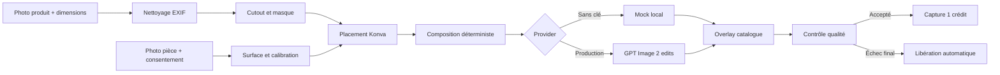

# Architecture

## Décisions du MVP

Le monorepo sépare les surfaces qui changent pour des raisons différentes, sans
multiplier les processus locaux :

- Next.js contient les pages publiques, marchand, client et administration.
- FastAPI possède l’autorité sur le tenant, les assets, crédits, paiements,
  rendus, tentatives et audits.
- Le worker importe le même pipeline idempotent que l’API. En démo, le job est
  exécuté immédiatement ; avec Redis, il est consommé depuis `renders`.
- SQLite et le disque sont les adaptateurs locaux. PostgreSQL, Redis et MinIO
  sont disponibles dans Compose.

## Tranche verticale

L’échelle et le placement ne sont jamais délégués à la génération. Pour un mur,
un segment connu fournit `pixels/cm`. Pour une surface rectangulaire, quatre
coins et les dimensions réelles produisent une homographie 3×3.

## Données

La migration initiale crée les tables demandées : utilisateurs, organisations,
memberships, produits, assets, ancres, scènes, surfaces, calibrations,
placements, rendus, tentatives, portefeuilles, transactions, abonnements,
widgets, événements analytics et audits. `payments` complète l’idempotence
Konnect.

Toutes les entités métier portent l’organisation. Les accès applicatifs
rejouent cette contrainte dans chaque requête. Les portefeuilles imposent
`balance >= 0`, les clés d’idempotence sont uniques par organisation, et une
tentative est unique par numéro dans un rendu.

## Limites explicites

- La segmentation locale retire un fond proche du blanc. L’UI expose le contrat
  du futur éditeur pinceau/SAM, mais le moteur GPU n’est pas livré dans le MVP.
- L’analyse de profondeur/surfaces est une suggestion déterministe en local.
- Un seul objet est placé par rendu.
- Les catégories réfléchissantes, transparentes ou déformables restent exclues.
- L’adaptateur R2/S3 doit être activé et testé avec un compte réel avant une
  production multi-instance ; Compose utilise actuellement un volume local.

