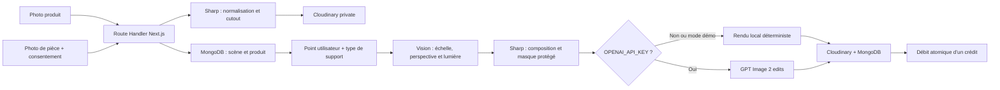

# Architecture

## Décision

LiliDecoAI est une application full-stack Next.js :

- les pages React, l’authentification et les API `/v1/*` vivent dans
  `apps/web` ;
- les Route Handlers Next.js s’exécutent comme fonctions Node.js sur Vercel ;
- MongoDB est l’unique base de données ;
- Cloudinary conserve les images avec le type `private` en production ;
- Sharp assure normalisation, composition, masque et rendu local ;
- OpenAI analyse la pièce puis GPT Image 2 harmonise le rendu, de façon
  optionnelle et uniquement côté serveur.

Il n’existe aucun processus Python, worker ou serveur API séparé.

## Flux de rendu

Le client place un point rouge sur la photo et choisit le type de support. Le
modèle de vision respecte ce point puis propose l’échelle, la rotation et la
lumière à partir de la photo et des dimensions réelles. Si l’analyse distante
échoue, un placement local borné conserve le point choisi.
GPT Image ne peut modifier que le halo transparent autour du produit ; le produit
déjà composé reste protégé.

## Données MongoDB

Le client MongoDB est partagé entre invocations chaudes et utilise un pool
borné. Des index uniques protègent les identifiants, les utilisateurs, les
portefeuilles et les clés d’idempotence.

Collections principales :

- `organizations`, `users`, `products`, `assets`, `scenes`, `calibrations` ;
- `renders`, `render_attempts` ;
- `wallets`, `credit_transactions` ;
- `analytics_events`, `audit_logs`.

Toutes les requêtes métier incluent `organizationId`. Les photos temporaires ont
une date d’expiration ; le cron Vercel supprime l’objet Cloudinary avant ses
métadonnées MongoDB.

Le widget démarre par `/v1/visualizer/:merchantSlug/:productId`. Cette route
émet une session anonyme signée limitée à ce produit et à un identifiant de
session. Les scènes et rendus créés par un visiteur ne sont ensuite accessibles
que depuis cette même session.

## Limites assumées du MVP

- une photo source peut peser jusqu’à 20 Mo ; le navigateur la réduit à 2 048 px
  et sous 3,5 Mo avant de l’envoyer à la fonction Vercel ;
- un seul objet est placé par rendu ;
- le rendu OpenAI est synchrone et borné par la durée maximale de la fonction ;
- le détourage local retire le fond connecté aux bords avec une transition
  alpha douce et conserve mieux les parties claires internes ;
- les objets transparents, réfléchissants ou déformables restent hors périmètre ;
- le cron fourni est quotidien ; un plan Vercel permettant une fréquence plus
  élevée peut réduire la fenêtre réelle de suppression.
