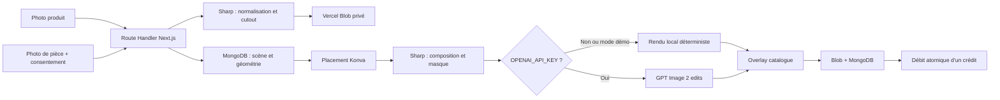

# Architecture

## Décision

LiliDecoAI est une application full-stack Next.js :

- les pages React, l’authentification et les API `/v1/*` vivent dans
  `apps/web` ;
- les Route Handlers Next.js s’exécutent comme fonctions Node.js sur Vercel ;
- MongoDB est l’unique base de données ;
- Vercel Blob privé conserve les images en production ;
- Sharp assure normalisation, composition, masque et rendu local ;
- OpenAI GPT Image 2 est un enrichissement serveur optionnel.

Il n’existe aucun processus Python, worker ou serveur API séparé.

## Flux de rendu

L’échelle et le placement restent déterministes. L’IA ne choisit pas la taille
du produit : elle harmonise uniquement l’éclairage, l’ombre, le contact et les
contours dans le masque autorisé.

## Données MongoDB

Le client MongoDB est partagé entre invocations chaudes et utilise un pool
borné. Des index uniques protègent les identifiants, les utilisateurs, les
portefeuilles et les clés d’idempotence.

Collections principales :

- `organizations`, `users`, `products`, `assets`, `scenes`, `calibrations` ;
- `renders`, `render_attempts` ;
- `wallets`, `credit_transactions` ;
- `analytics_events`, `audit_logs`.

Toutes les requêtes métier incluent `organizationId`. Les photos temporaires ont
une date d’expiration ; le cron Vercel supprime le binaire Blob avant ses
métadonnées MongoDB.

Le widget démarre par `/v1/visualizer/:merchantSlug/:productId`. Cette route
émet une session anonyme signée limitée à ce produit et à un identifiant de
session. Les scènes et rendus créés par un visiteur ne sont ensuite accessibles
que depuis cette même session.

## Limites assumées du MVP

- une image envoyée à une fonction Vercel est limitée à 4 Mo ;
- un seul objet est placé par rendu ;
- le rendu OpenAI est synchrone et borné par la durée maximale de la fonction ;
- la segmentation locale retire surtout les fonds clairs et neutres ;
- les objets transparents, réfléchissants ou déformables restent hors périmètre ;
- le cron fourni est quotidien ; un plan Vercel permettant une fréquence plus
  élevée peut réduire la fenêtre réelle de suppression.
