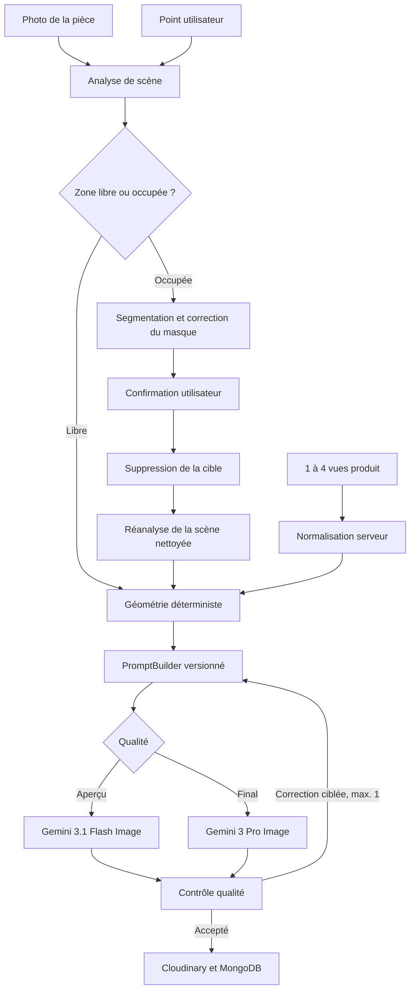

# Architecture

LiliDecoAI reste une application full-stack Next.js. Les pages React,
l’authentification et les routes `/v1/*` vivent dans `apps/web` et sont
hébergées ensemble sur Vercel. MongoDB est l’unique base ; Cloudinary stocke les
images privées ; Sharp normalise et compose les images. Il n’existe ni FastAPI,
ni Supabase, ni worker Python séparé.

## Flux de rendu

La photo originale de la pièce est toujours fournie au rendu premium. Une
prévisualisation compressée n’est jamais sa seule référence. La géométrie,
l’échelle, les coordonnées et le confinement au masque restent déterministes
autant que possible ; le modèle génératif harmonise les pixels dans ces
contraintes.

## États et données

Le client suit `uploaded`, `analyzing_scene`, `segmenting_target`,
`awaiting_mask_confirmation`, `computing_geometry`, `removing_target`,
`building_prompt`, `generating_preview`, `generating_final`, `quality_check`,
`retrying`, `completed`, `failed` et `refunded`.

MongoDB conserve notamment :

- `products` avec 1 à 4 vues validées et leurs rôles ;
- `scenes`, analyse et durée de conservation ;
- `segmentations` et masque confirmé ;
- `renders`, mode, surface, points, dimensions, lumière, calibration, chaîne de
  modèles, score, latence, coût et version de prompt ;
- `render_attempts` pour chaque appel normalisé ;
- `render_feedback`, crédits, analytics sans image et audits ;
- `rate_limits` pour les quotas serveur.

Le script `npm run migrate:image-pipeline` est une simulation par défaut. Il
ajoute les champs compatibles aux anciens documents seulement avec `-- --apply`
et ne supprime aucune donnée.

## Limites connues

- Sans calibration réelle, l’échelle reste estimée et l’interface l’indique.
- La segmentation compatible point/masque est interchangeable ; le backend
  actuel propose un masque assisté à corriger, pas un modèle SAM local lourd.
- Le parcours public accepte jusqu’à trois produits dans une seule édition ;
  les anciens parcours marchands conservent leurs contrats historiques.
- Les angles produit absents sont estimés et ne sont jamais présentés comme
  parfaitement fidèles.
- Les surfaces réfléchissantes, transparentes ou très occultées peuvent
  nécessiter une nouvelle photo ou une correction de masque.
