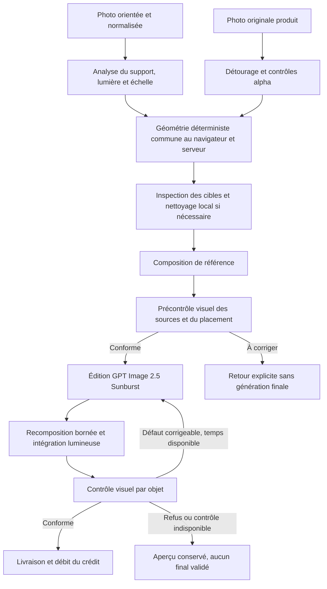

# Audit et renforcement du système d’image — 20 septembre 2026

## Conclusion

Les défauts de position, de taille et d’effet « collé » ne viennent pas seulement
du prompt. Ils traversent l’orientation des photos, l’estimation de l’échelle,
le détourage, le compositing et la vérification finale. Changer uniquement de
modèle aurait laissé plusieurs erreurs déterministes intactes.

Cette intervention corrige ces mécanismes dans le code local et renforce le
parcours public `simple_point`. Elle ne constitue ni un déploiement, ni une
mesure de qualité sur des photos réelles. Aucune clé OpenAI utilisable n’est
présente dans l’environnement local examiné et le corpus ne contient encore
aucun cas réel renseigné. Les appels fournisseurs sont simulés dans les tests.

## Défauts et corrections livrées

| Cause observée dans le code                                               | Conséquence                                                                  | Correction                                                                                                 |
| ------------------------------------------------------------------------- | ---------------------------------------------------------------------------- | ---------------------------------------------------------------------------------------------------------- |
| Le routeur construisait `OpenAIImageProvider("gpt-image-2")` directement  | Une modification de `OPENAI_MODEL` n’avait aucun effet sur le parcours photo | Le routeur utilise le modèle configuré et respecte son activation                                          |
| `rotate().metadata()` lisait les dimensions avant rotation EXIF           | Points et mesures incorrects sur certaines photos portrait                   | Les dimensions proviennent de l’image réellement orientée                                                  |
| Segment horizontal de 10 cm utilisé pour déterminer une hauteur verticale | Échelle biaisée par la perspective du support                                | Consigne de mesure adaptée aux objets debout/muraux et aux objets à plat                                   |
| Interpolation d’échelle par ratio des coordonnées verticales              | Propagation entre profondeurs et supports incompatibles                      | Transfert limité aux repères proches, compatibles et situés sur le même plan                               |
| Repères sans étendue visible mesurable et cache trop grossier             | Fausse confiance et réemploi d’une estimation à un autre point               | Validation des preuves, cache versionné et coordonnées plus précises                                       |
| Plancher de taille de 24 pixels même avec calibration                     | Petits objets artificiellement agrandis                                      | Échelle calibrée respectée ; petite taille ne signifie plus agrandissement automatique                     |
| Ligne de contact située au-dessus du bas du détourage                     | L’objet physique devenait plus petit que les dimensions demandées            | Conversion tenant compte de la fraction de hauteur jusqu’à la base                                         |
| Quelques pixels transparents suffisaient à déclarer un PNG détouré        | Fond de studio conservé comme un rectangle                                   | Détection du contenu alpha, contrôle du matte et des composantes                                           |
| RGB invisible utilisé dans l’analyse de fond/ombre                        | Pieds coupés, mauvaise ligne de base                                         | Pixels transparents exclus de ces décisions                                                                |
| Recollage intégral du cœur brut après harmonisation                       | L’éclairage catalogue revenait après génération                              | Transfert borné de luminance basse fréquence, avec conservation de la géométrie, de l’alpha et des détails |
| Masques insuffisants sur objets muraux ou plats                           | Contact visuel absent                                                        | Zones locales adaptées pour l’occlusion ambiante et le contact                                             |
| Réencodages destructifs successifs                                        | Franges et perte des détails fins                                            | Images intermédiaires et recomposition finale sans perte                                                   |
| QA sans image de la composition attendue                                  | Objet plausible mais mal placé accepté                                       | Comparaison pièce originale + composition + résultat + chaque original produit                             |
| Verdict global sans preuves par objet                                     | Un bon objet pouvait masquer le défaut d’un autre                            | Contrôles structurés par objet, couverture des identifiants et seuils locaux obligatoires                  |
| Une seule tentative sur le parcours public                                | Défaut corrigeable livré en échec immédiatement                              | Une reprise ciblée au maximum, toujours depuis la composition initiale                                     |
| Coût final limité à la dernière image et ancienne grille                  | Analyses et reprises invisibles                                              | Total des appels du rendu ; jetons image retournés utilisés lorsqu’ils sont disponibles                    |

## Chaîne active après modification



Le précontrôle ne demande pas que le composite ait déjà ses ombres finales.
Il bloque les problèmes que l’harmonisation ne doit pas inventer : fond produit
restant, parties manquantes, support impossible, perspective incompatible ou
dimensions visiblement incohérentes. Le contrôle final vérifie présence,
identité, position, taille, perspective, contact, contours, lumière, ombres,
occlusions, doublons et préservation de la pièce.

Une réponse incomplète, un refus du fournisseur, une preuve manquante ou une
confiance insuffisante ne peut pas valider un rendu. Une bonne note globale ne
compense pas un défaut bloquant. La reprise conserve l’image source et le
placement prévu ; elle ne réutilise pas un résultat déjà déformé comme base.

## Modèles et réglages

La documentation officielle consultée le 20 septembre 2026 désigne
[GPT Image 2.5 Sunburst](https://developers.openai.com/api/docs/models/gpt-image-2.5-sunburst)
comme son modèle d’image le plus capable, avec les qualités `xhigh` et `max`.
Le modèle est désormais le défaut et la qualité demandée est `max`.
[GPT-6 Astra](https://developers.openai.com/api/docs/guides/latest-model)
est utilisé par défaut pour l’analyse visuelle et le contrôle structuré.
Le service de traitement reste `default`, compatible avec les contraintes
documentées de résidence européenne ; aucun paramètre de température n’est ajouté.

La vérification emploie un modèle de vision/raisonnement : un générateur d’image
supplémentaire comme DALL-E n’apporte pas, à lui seul, de décision structurée
sur le respect du placement. C’est un choix d’architecture pour ce besoin.

```dotenv
OPENAI_MODEL=gpt-image-2.5-sunburst
OPENAI_VISION_MODEL=gpt-6-astra
OPENAI_QUALITY=max
OPENAI_SERVICE_TIER=default
OPENAI_MAX_COST_USD=5
RENDER_MAX_COST_USD=20
```

Ces réglages figurent dans `.env.example` et dans le `.env` local. Les clés et
les choix d’activation existants sont conservés. Les variables du déploiement
doivent être mises à jour séparément ; leur valeur peut remplacer ces défauts.
Le précontrôle de production vérifie l’accès aux modèles effectivement configurés.
Les anciens modèles explicitement conservés reçoivent `high` lorsque `max` ou
`xhigh` n’est pas pris en charge. Aucun modèle inférieur n’est substitué
silencieusement en cas de refus d’accès.

Les plafonds sont des protections contre les boucles, pas un objectif
d’optimisation. La consommation de GPT Image 2.5 varie : l’ancienne grille
par image de GPT Image 2 n’est pas une estimation fiable pour ce modèle. Le
journal utilise les jetons retournés lorsqu’ils existent ; les provisions
restantes sont des approximations opérationnelles, pas des factures.
Voir [l’API image officielle](https://developers.openai.com/api/docs/guides/image-generation).

## Limites restantes et solutions prioritaires

### 1. Exécution durable pour la montée en charge

Le serveur utilise encore une tâche différée Next.js, avec une route plafonnée
à 300 secondes. Le nouveau parcours garde une échéance de 285 secondes et
réserve 45 secondes au contrôle après édition. La seconde génération n’est
tentée que si le temps restant le permet. Cela évite une boucle illimitée,
mais ne rend pas l’exécution durable et peut refuser des cas lents.

La prochaine évolution d’infrastructure doit sortir les calculs de la requête
web : file persistante, processus de rendu séparés et nombre de tâches
simultanées borné par fournisseur. Contrat proposé :

- un job identifié par `renderId`, avec références d’assets et paramètres
  normalisés, sans images encodées dans le message de file ;
- réservation atomique avec bail et renouvellement ; aucune exécution double
  simultanée du même rendu ;
- points de reprise après analyse, détourage, nettoyage et génération ;
- identifiant d’appel stable par étape et tentative ; un résultat fournisseur
  incertain nécessite rapprochement avant nouvelle dépense ;
- annulation vérifiée entre étapes, avant tout nouvel appel et avant livraison ;
- limites de concurrence globale et par boutique, attente sur `429`, reprise
  avec délai progressif, file des échecs permanents ;
- métriques par étape : latence p50/p95, attente, timeout, taux de reprise,
  acceptation humaine, coût d’un rendu accepté, version et modèle effectifs.

Cette infrastructure n’est pas déployée par cette intervention. Elle est
nécessaire avant de promettre une capacité de production à grande échelle.

### 2. Échelle physique et perspective

Une seule photo sans étalon ne fournit pas de mesure métrique fiable. Les
repères familiers restent des hypothèses, même avec un meilleur modèle.
Conserver l’indication « estimée », faciliter un segment de longueur connue
au même endroit que l’objet et préférer la calibration utilisateur.

Les objets plats utilisent encore un raccourcissement fixe : une homographie
fondée sur quatre points du plan serait plus exacte pour un tapis. Les vues
produit absentes et l’occlusion par du mobilier réel nécessitent des masques de
profondeur ou d’occlusion explicites. Le contrôle ajouté peut refuser ces
défauts ; il ne remplace pas une reconstruction de scène en 3D.

### 3. Détourage difficile

Le pipeline conserve une segmentation heuristique locale. Les objets en verre,
les mailles, les feuillages fins et les fonds chargés restent difficiles.
Prévoir un service spécialisé de segmentation/alpha matting, puis raffinement
des contours en pleine résolution, avec conservation des pixels source et
vérification des parties fines. Générer à nouveau le produit entier n’est pas
une garantie d’identité. Les anciens détourages doivent être régénérés pour
bénéficier du nouvel algorithme ; les résultats historiques ne sont pas réécrits.

### 4. Mesure sur images réelles avant généralisation

Constituer au minimum 20 cas avec photos de pièce et produit, dimensions
mesurées et placement attendu. Inclure portrait EXIF, petit objet, vase blanc,
verre, plante fine, étagère avec rebord, surface brillante, mur, tapis oblique,
occlusion, plusieurs objets et remplacement.

Exécuter l’ancien et le nouveau profil sur les mêmes entrées et conserver
chaque étape avec `RENDER_STAGE_CAPTURE=true` pendant cette campagne. Comparer
position/échelle, identité, défauts de matte, contact, préférence humaine en
aveugle, acceptation du premier essai, reprises et latence. Les seuils visuels
actuels sont une politique initiale : les ajuster à partir de faux positifs et
faux négatifs observés, jamais pour simplement faire monter le taux d’acceptation.

## Validation locale

Les suites ciblent les dimensions EXIF, les conversions métriques et le point
de contact, les pixels alpha/contours, les objets fins, la conservation du
fond, le transfert lumineux borné, le contrat des requêtes fournisseur,
le précontrôle, le contrôle par objet, les reprises et les annulations.
Résultat : **375 tests passent** (308 web, 44 géométrie, 17 routeur/prompts,
6 contrats de données). La suite web exclut explicitement les fichiers
expérimentaux préexistants `__scratch` et `zz-*`. ESLint passe sur les modules
et tests modifiés ; `git diff --check` ne signale pas d’erreur.

Ces tests vérifient le logiciel ; ils ne mesurent pas le photoréalisme du
nouveau modèle. Le contrôle TypeScript global rencontre encore **18 erreurs**
dans les fichiers expérimentaux `scratch`/`zz-*`, à traiter séparément sans
effacer ces travaux. Les autres espaces de travail passent ce contrôle.
