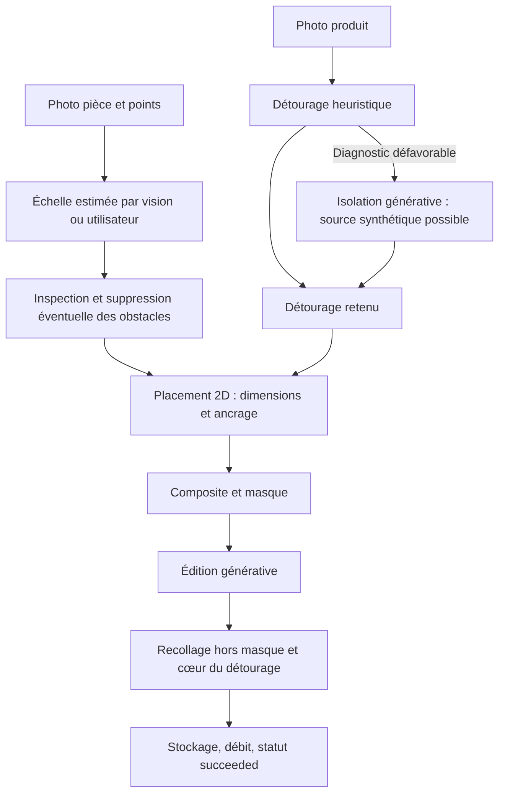
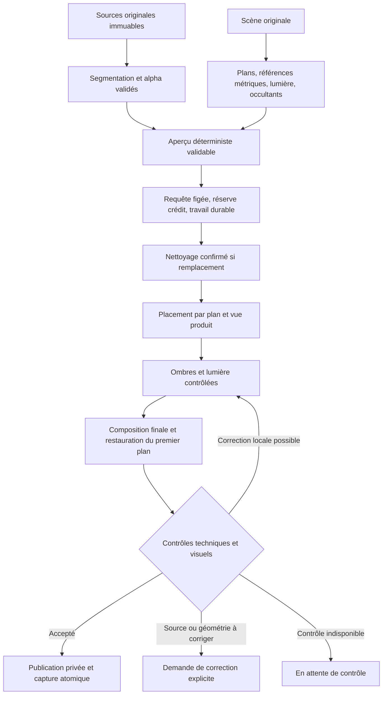

# Audit et plan de professionnalisation — LiliDecoAI

Date : 5 septembre 2026. Statut : audit du code local et plan proposé, corrections non implémentées.

## 1. Décision recommandée

Conserver Next.js, MongoDB, le stockage privé, Sharp et la géométrie partagée. Faire évoluer le moteur vers une composition contrôlée, mesurée et vérifiée, avec génération limitée aux effets d'intégration. Le changement de modèle et les ajustements de prompt ne résolvent pas les défauts structurels identifiés.

La promesse professionnelle doit être : **le bon produit, au bon endroit, à une échelle dont la précision est connue, avec une intégration crédible et une livraison fiable**. Un beau rendu qui modifie un produit est un échec. Une composition fidèle dont la perspective est fausse en est un également.

Première version professionnelle : objets opaques, photos produit exploitables, angle compatible, surfaces identifiables ; tapis et tableaux avec calibration du plan. Les transparences, miroirs, matières très réfléchissantes et changements importants de vue restent des capacités expérimentales jusqu'à validation spécifique. L'interface peut accepter ces demandes, mais doit annoncer leurs limites avant lancement et proposer une autre photo ou un parcours assisté.

## 2. Périmètre et niveau de preuve

- Base Git : `3040594f2e89ceaaed43988a086f8e7208fe7e04`, **avec modifications locales préexistantes**. Les conclusions concernent ce contenu local, pas nécessairement le déploiement actuel.
- Parcours examinés : démo `simple_point`, rendu standard OpenAI/Google, détourage, estimation d'échelle, masques, compositing, crédits, annulation/retry, assets, conservation, tests et CI.
- Lecture du code et reproductions locales sans appel de génération payant. Aucun secret affiché, aucune modification des données de production.
- Aucun corpus réel de rendus ratés inspecté : fréquence, taux de fidélité et cause d'une image particulière restent à mesurer.
- Audit ciblé de confidentialité et fiabilité ; ne constitue pas un audit exhaustif de sécurité, juridique, accessibilité ou charge.
- Les objectifs chiffrés ci-dessous sont des **seuils de lancement proposés**, pas des performances actuelles.

Les points solides sont réels : précomposition déterministe, contrat de placement partagé navigateur/serveur, masque local, remise en place du cœur des produits, gestion du cadrage, métadonnées de provenance, contrôles d'entrée, stockage avec mécanisme de purge et tests hors fournisseurs. Ces éléments doivent être conservés et mieux reliés.

## 3. Pipeline réellement utilisé

Le parcours public aboutit à cette finalisation sans contrôle qualité visuel final. Le parcours standard possède un autre système de contrôle ; il ne suffit donc pas de renforcer ce dernier pour corriger la démo.

## 4. Constats priorisés et preuves

Priorités : **P0** bloque la promesse commerciale ou l'intégrité du service ; **P1** nécessaire pour la version professionnelle ; **P2** amélioration après stabilisation. « Confirmé » signifie établi par lecture ou reproduction du code, sans présumer sa fréquence en production.

| ID | Priorité | Constat et preuve locale | Conséquence / action |
|---|---|---|---|
| A01 | P0 | `rendering.ts:946–1011` : `simple_point` stocke et débite avec `qualityScore: null`, `qualityChecks: []`, puis `succeeded`. Confirmé. | Introduire une décision qualité obligatoire commune à tous les parcours avant livraison/débit final. |
| A02 | P0 | `rendering.ts:3635–3674` : indisponibilité ou temps insuffisant du contrôle OpenAI → `accepted: true`, score `0.9`. Confirmé pour ce parcours standard. | Remplacer le faux succès par `quality_unavailable`; conserver l'aperçu, reprendre le contrôle sans régénérer. |
| A03 | P0 | `assets.ts:91–144`, `api.ts:469–517` : isolation par édition générative et `synthetic: true`. La validation de l'isolation vérifie notamment la transparence, pas l'identité. Confirmé. | Extraire un masque depuis la photo originale ; un détourage régénéré ne devient jamais la référence de fidélité. |
| A04 | P1 | `simple-placement.ts:93–180` : échelle par défaut de 300 cm, facteur à plat `0.45`, conservation de l'aspect pour les objets debout. `simple-composite.ts:580` applique `fit: "fill"`. Confirmé, exemple reproduit ci-dessous. | Adapter le placement à la caméra et au plan. Éliminer les déformations arbitraires, séparer dimensions réelles et silhouette projetée. |
| A05 | P1 | `scale-estimation.ts` estime une portée horizontale de 10 cm ; `computeSimplePlacement` emploie un unique `pixelsPerCm`, y compris pour la hauteur. Confirmé ; erreur métrique réelle non mesurée. | Une échelle horizontale sur un plan n'est pas une calibration de toutes les directions. Stocker axe, plan, profondeur et incertitude. |
| A06 | P1 | `simple-composite.ts:797–840` remet le cœur du détourage original, érodé de 2 px, au-dessus du résultat généré. Confirmé. | Protection utile mais lumière d'origine réintroduite. Les parties fines peuvent perdre tout cœur protégé. Protection adaptative et relighting borné à développer. |
| A07 | P1 | Le composite ordonne les produits insérés entre eux ; la remise en place finale n'utilise pas de masque des objets existants situés au premier plan. Confirmé sur le parcours simple. | Un rebord ou élément de mobilier peut être recouvert. Restaurer les occultants de la scène après le produit et ses effets. |
| A08 | P0 | `rendering.ts:752–811` : erreurs d'inspection/removal interceptées puis insertion poursuivie ; suppression via rectangle dilaté (`openAIRemoveObstacle`). Confirmé. | Superposition ou reconstruction locale incorrecte possible. Choix explicite Ajouter/Remplacer, masque précis, validation du nettoyage et arrêt si précondition non satisfaite. |
| A09 | P0 | `api.ts:1160–1171` annule ; `runSimplePointRender` n'appelle pas `assertRenderActive` et sa finalisation filtre seulement sur l'ID. Confirmé statiquement. | Course possible : annulation suivie d'un succès et débit. Transitions conditionnelles atomiques et vérification avant chaque effet externe/finalisation. |
| A10 | P1 | `api.ts:1198–1226` reconstruit le retry sans `workflow` et sans les placements simples au premier niveau. `createRender` choisit le parcours sur `workflow`. Confirmé pour cet endpoint. | Un retry d'un rendu simple peut changer de moteur et perdre le contrat multi-objet. Persister puis rejouer la requête normalisée complète et versionnée. Vérifier séparément les boutons qui relancent une nouvelle requête client. |
| A11 | P0 | `credits.ts:29–76` débite atomiquement le wallet, puis écrit le journal séparément ; `rendering.ts` stocke l'image, débite puis finalise. Pas de réservation préalable identifiée dans ces parcours. Confirmé. | Concurrence : appels payants sans crédit garanti ; interruption : incohérence wallet/journal/rendu. Réservation et transaction de finalisation, rapprochement et outbox. |
| A12 | P1 | Route `v1/[...path]/route.ts` : `after(task)` et `maxDuration=300`. Jusqu'à trois suppressions séquentielles à 145 s, plus édition à 180 s et analyses dans le parcours simple. Confirmé ; dépassement effectif non mesuré. | Les plafonds cumulés excèdent la durée de route. Exécution durable par étapes, échéance globale, reprise après interruption et surveillance des travaux bloqués. |
| A13 | P1 | `runSimplePointRender` finalise le coût avec celui de l'édition principale ; les appels directs de détourage, d'échelle, d'inspection et de nettoyage n'alimentent pas tous le même journal d'usage. Coûts OpenAI estimés par constantes. Confirmé. | Mesurer tous les appels, y compris échecs et retries, puis coût par rendu accepté. Plafond global avant chaque nouvelle étape payante. |
| A14 | P1 | Sources et base recomposées en WebP avec pertes ; `pasteBackOutsideMask` exporte à qualité 94. Confirmé. | « Chaque pixel identique » ne vaut pas pour le fichier final. Conserver des intermédiaires sans pertes et vérifier le composite avant compression. |
| A15 | P1 | `sceneScaleCacheKey` : points arrondis à 2 décimales et type de placement ; cache borné, mais sans version du modèle/prompt/algorithme. Confirmé. | Deux points proches de part et d'autre d'un rebord peuvent partager une estimation ; évolution du moteur sans invalidation. Versionner le cache et distinguer le support. |
| A16 | P0 | `api/assets/[id]/route.ts:31–35` : assets `product`/`cutout` publics, y compris selon le type plutôt que leur publication ; `DEMO_MODE` court-circuite le contrôle des autres images. Confirmé. | Une URL connue suffit dans ces cas. Séparer catalogue publié et uploads privés ; ne jamais utiliser un mode démo qui désactive l'autorisation pour des photos réelles. Pas de preuve ici d'une fuite effective. |
| A17 | P1 | Purge quotidienne, lots de 500 ; `readAsset` ne vérifie pas lui-même `expiresAt`. Confirmé. | Expiration logique et suppression physique peuvent diverger. Refuser la lecture après expiration, purger tous les dérivés et suivre le retard de purge. |
| A18 | P1 | Tests de géométrie, alpha et parcours mock présents ; pas de benchmark photographique versionné identifié dans les fichiers examinés. Le test navigateur `visualizer.spec.ts:363` attend un bouton absent de l'interface actuelle. Plusieurs chemins de rendu, plus de 4 000 lignes dans `rendering.ts`. | Les tests unitaires verts ne mesurent pas le réalisme et le parcours E2E de rendu n'est pas validé. Réconcilier les tests avec l'interface, ajouter corpus et évaluation, puis mutualiser orchestration/finalisation sans réécriture globale. |

### Reproduction géométrique réalisée

Exécution de la vraie fonction `computeSimplePlacement`, compilée en mémoire depuis le TypeScript local : scène 1 200 × 900, photo de tapis d'aspect 2:1, dimensions 200 × 100 cm, `pixelsPerCm=2`, `kind=flat`.

Résultat : **400 × 90 pixels**, aspect **4,444:1**, `dimensionConsistency=2,222`. Le facteur 0,45 explique exactement la déformation. Cette forme peut correspondre fortuitement à une prise de vue, mais le calcul ne reçoit aucun angle du sol permettant de la justifier. Cela établit une approximation systématique, pas la proportion de rendus ratés.

### Précisions importantes

- Conserver les pixels du détourage ne garantit pas l'identité si ce détourage a été synthétisé ou amputé.
- Une homographie convient à un produit plan ; elle ne reconstruit pas les faces invisibles d'un vase ou d'une chaise.
- Deux points et une distance donnent une échelle locale dans une direction. Pour un tapis, il faut calibrer son plan ; pour une hauteur, une référence verticale compatible ou une estimation de caméra vérifiée. Un curseur de taille exprime un choix visuel, pas une mesure physique.
- Une erreur d'échelle, une mauvaise source ou un angle impossible doivent être corrigés avant génération, pas « réparés » en demandant au modèle de réinventer l'objet.

## 5. Architecture cible

### Contrats à introduire

- `ProductIdentity` : original et hash, vues/angles, dimensions et provenance, masque alpha, repères distinctifs, version du détourage, indicateur synthétique historique. Recalculer les anciens détourages synthétiques depuis l'original lorsque possible.
- `SceneGeometry` : hash de scène, plans et polygones, références mesurées avec axe et incertitude, paramètres de projection disponibles, occultants et lumière. Autoriser `unknown` au lieu d'inventer une précision.
- `PlacementContract` : objets, vues sélectionnées, dimensions, ancrages, transforms, ordre de profondeur, source d'échelle, régions de modification autorisées. Partagé par l'aperçu et le serveur.
- `RenderJob` : requête normalisée immuable, versions des modèles/prompts/moteur, étapes persistées, jeton d'exécution, lease, heartbeat, échéance, budget et réservation.
- `QualityDecision` : `accepted | rejected | needs_input | unavailable`, résultats par dimension, preuves et version des critères. Pas de score global fabriqué.
- `ProviderUsage` : appel, étape, durée, usage retourné, coût estimé ou réconcilié, résultat connu/inconnu et clé métier. Une réponse réseau perdue n'implique pas un coût nul.

### Choix techniques recommandés

1. **Segmentation** : mettre en concurrence un modèle produisant un masque, tel SAM 2, et une solution de détourage avec alpha sur le corpus réel. SAM 2 est une base de segmentation, pas une garantie de matting fin ou de traitement du verre. Mesurer qualité, coût, latence, hébergement et confidentialité avant le choix final. Aucun nouveau fournisseur n'est nécessaire pour commencer les corrections A01/A02/A09/A10.
2. **Projection** : utiliser les primitives d'homographie déjà présentes dans `packages/geometry` pour les plans calibrés. Pour le volume, choisir une vue compatible ; développer plus tard une voie 3D à partir d'assets marchands vérifiés. Ne pas promettre une reconstruction exacte depuis une photo.
3. **Lumière** : conserver RGB/alpha de référence séparés des effets. Relighting limité en amplitude et fréquence spatiale, contrôlé sur les détails ; ombres/contact sur des couches dédiées. Comparer cette voie au recollage actuel. Pour les matériaux hors périmètre, proposer une autre prise de vue plutôt qu'une correction incontrôlée.
4. **Travaux durables** : garder Next.js pour l'interface/API ; exécuter les étapes lourdes dans un worker avec file persistante. Le contrat doit survivre à un redémarrage indépendamment du prestataire de file. Ne pas simplement déplacer toute la fonction actuelle dans une tâche longue.
5. **Crédits** : réservation au lancement, capture après acceptation, libération lors d'un échec/annulation. Atomicité de l'état métier via transactions MongoDB, sur un déploiement qui les supporte ; stockage image hors transaction, publication par référence avec nettoyage des orphelins. La CI devra utiliser un replica set pour tester ces transactions.

## 6. Expérience produit professionnelle

Le parcours principal reste court : **préparer l'objet → choisir le lieu → positionner → vérifier → générer**.

- À l'import, montrer le détourage à taille utile, signaler parties coupées/flou, permettre conserver/effacer au pinceau et annuler. Demander une autre photo uniquement quand elle est nécessaire.
- Proposer « Ajouter » ou « Remplacer ». Pour remplacer, montrer la zone réellement supprimée et permettre sa correction ; ne pas inférer silencieusement une suppression depuis un point.
- Afficher « Échelle estimée », « Taille ajustée visuellement » ou « Échelle calibrée », avec explication adaptée. Ne pas convertir une confirmation de curseur en certificat de dimensions.
- Demander la référence métrique quand la précision compte ; interaction adaptée au plan ou à la hauteur, sans formulaire de caméra imposé au grand public.
- Présenter l'aperçu rapide comme un aperçu. Le conserver en cas d'échec d'harmonisation, sans le faire passer pour un rendu final vérifié.
- Permettre ajustements d'un objet, comparaison avant/après et variantes nommées. Rejouer uniquement les étapes invalidées par la modification.
- Retour utilisateur structuré : forme, taille, position, lumière, décor modifié ; conserver la note libre existante. Relier ce retour aux étapes et versions, pas seulement au prompt.
- Résultat professionnel exportable : image haute résolution, version du projet et provenance interne. Les détails techniques restent dans le diagnostic marchand/support.

## 7. Validation mesurable

### Corpus et protocole

Constituer **120 scènes de référence autorisées**, dont 30 réservées et jamais utilisées pour ajuster les seuils. Inclure des photos du produit réellement placé dans la pièce, dimensions mesurées et vue produit indépendante. À défaut de vérité terrain, distinguer explicitement appréciation humaine et précision métrique.

Répartir par strates : objets opaques simples, détails fins/anses/pieds, surfaces planes et perspectives, faible lumière/fonds complexes, premier plan/remplacement, puis matériaux difficiles. Croiser ces strates avec 1/2/3 objets, portrait/paysage, bords de cadre et résolutions. Les catégories expérimentales sont rapportées séparément ; leurs échecs ne doivent pas disparaître dans une moyenne.

Sur 20 cas sensibles, faire trois générations indépendantes pour mesurer la variance. Comparaison aveugle avec la version de référence, deux évaluateurs pour le pilote, arbitrage des désaccords. Fixer le protocole avant le benchmark et conserver aussi les rejets : un système qui refuse presque tout n'est pas professionnel.

### Seuils initiaux proposés

| Dimension | Mesure | Porte de lancement proposée |
|---|---|---|
| Identité | Pièces manquantes/ajoutées, motifs et silhouette vs original | Zéro altération majeure parmi les résultats acceptés du jeu réservé ; publier l'effectif, sans prétendre prouver un risque nul en production. |
| Segmentation | IoU + contours + rappel des parties fines annotées | Cibles initiales IoU ≥ 0,98 pour objets opaques simples, rappel ≥ 0,98 des détails critiques ; confirmer leur pertinence sur le corpus. IoU seule insuffisante. |
| Échelle calibrée | Erreur relative vs référence physique compatible | Médiane ≤ 5 %, P95 ≤ 10 % sur périmètre supporté, rapport par orientation/plan. Aucune promesse métrique pour le mode estimé. |
| Placement | Distance de l'ancrage demandé et obtenu dans le composite | ≤ 2 px avant export ; contrôle visuel distinct du vrai point de contact physique. |
| Décor | Différence hors union des zones autorisées | Identité exacte sur buffers sans pertes avant export ; tolérance d'export mesurée séparément. |
| Occultation | Ordre correct et contours du premier plan | Aucun ordre inversé critique parmi les résultats acceptés du jeu réservé. |
| Réalisme | Évaluation aveugle sur contact, lumière, perspective | ≥ 90 % des résultats acceptés jugés utilisables sans retouche, sur catégories supportées. |
| Utilité | Part des entrées conformes livrées et acceptées humainement | Cible ≥ 85 % après au plus une réparation ciblée ; afficher aussi taux de rejet et demandes de nouvelle photo. |
| Finalisation | Scénarios répétés de concurrence/interruption | Aucun double débit, aucune résurrection d'un rendu annulé, journal et wallet réconciliés. |
| Exploitation | Travaux perdus, statuts et réconciliation | Aucun travail sans état terminal ou prise en charge explicite après son échéance ; alerte sur dépassement. |

Ces chiffres doivent être ratifiés après la première mesure. Un seul score moyen ne peut compenser un défaut critique. Le juge visuel peut détecter des problèmes, mais ne prouve ni les centimètres ni la conservation des pixels.

### Tests à ajouter

- Orchestration avec fournisseur simulé : contrôle indisponible, nettoyage refusé, erreur à chaque étape, reprise après arrêt du worker, annulation pendant l'appel, annulation contre finalisation, suppression en cours, double livraison de message.
- Crédits sur MongoDB replica set : dix demandes simultanées avec un crédit, répétition d'une même clé, crash après réservation/stockage/capture, rapprochement et libération.
- Retry d'une requête simple à trois objets : mêmes objets, dimensions, ancrages, workflow et versions ou migration explicite.
- Image : détails de 1–4 px, alpha partiel, halo, ombre de photo source, objets blancs/fonds blancs, rot EXIF, multi-objets et occultants.
- Géométrie : plans inclinés, references horizontales/verticales, point de part et d'autre d'une étagère, calibration dégénérée et incertitude.
- Autorisations : session A/B, marchand A/B, asset deviné, upload privé vs catalogue publié, expiration logique avant purge et mode démo.
- Browser : import/correction/calibration/remplacement/annulation/reprise sur desktop et mobile ; aucun appel payant en CI.

## 8. Plan d'exécution et critères de sortie

Estimations en jours-personne, incluant tests et revue, **non engagements de délai**. Hypothèse : une personne expérimentée full-stack avec compétence vision ou appui ponctuel. À recalibrer après le corpus et le choix de segmentation ; délais d'accès aux données et de pilote en plus.

| Phase | Livrables concrets | Effort | Dépendances et sortie |
|---|---|---:|---|
| 0 — Référence | 20 cas initiaux, taxonomie d'échecs, captures des étapes, baseline des versions et métriques ; snapshots des entrées | 3–4 j | Commencer ici. Chaque échec se localise entre source, détourage, placement, nettoyage, harmonisation et export. |
| 1 — Intégrité immédiate | Corriger A01/A02/A08/A09/A10 ; clôture conditionnelle ; confidentialité des uploads ; aperçu/qualité indisponible distincts | 5–7 j | Phase 0. Aucun succès sans décision valide ; pas d'annulation écrasée ; retry fidèle ; tests d'autorisation verts. |
| 2 — Source produit fiable | Sélection segmentation par benchmark, alpha corrigible, provenance originale, traitement des anciens détourages synthétiques | 6–9 j | Corpus phase 0. Aucun objet original remplacé par une référence régénérée ; détails fins vérifiés. |
| 3 — Géométrie | Calibration direction/plan, homographie pour plans, vue compatible pour volume, provenance et incertitude ; supprimer facteur fixe du parcours professionnel | 6–9 j | Contrats phases 0/2. Cibles métriques vérifiées sur références ; refus explicite des cas sous-déterminés. |
| 4 — Intégration | Masques d'occultation, nettoyage vérifié, ombres séparées, relighting borné, protection des détails, intermédiaires sans pertes | 6–10 j | Phases 2/3. Gain de réalisme en comparaison aveugle sans régression d'identité. |
| 5 — Exploitation | Worker durable, checkpoints, transactions/réservations, journal de tous les appels, budget global, watchdog, purge et reprise | 6–9 j | Contrats phase 1 ; peut avancer pendant 2–4 si plusieurs personnes. Tous les scénarios de panne et concurrence passent. |
| 6 — Qualification/pilote | Corpus complet, jeu réservé, régression photographique, ergonomie finale, canary et tableau de suivi | 5–7 j | Phases 1–5. Critères de lancement atteints ou périmètre explicitement réduit. |

Total : **37–55 jours-personne**, soit environ **8–11 semaines de réalisation pour une personne**, hors attente de corpus et durée d'observation du pilote. Une première livraison utile de sécurisation arrive à l'issue des phases 0–1. Ne pas attendre la fin pour corriger les faux succès et les courses de finalisation.

### Première série de tickets prêts à ouvrir

| Ticket | Action | Définition de terminé |
|---|---|---|
| PRO-001 | Persister le contrat complet de rendu et sa version | Retry à 3 objets identique ; ancien format migré ou rejeté explicitement. |
| PRO-002 | Unifier `QualityDecision` et la politique de livraison | Absence de contrôle = `unavailable`, jamais score 0,9 ; mock isolé des preuves qualité. |
| PRO-003 | Centraliser transitions/finalisation | Cancel/delete ne peuvent plus être remplacés par un succès tardif ; tests de course. |
| PRO-004 | Réserver les crédits et réconcilier les écritures | Réservation unique, capture/libération idempotentes, reprise de transaction. |
| PRO-005 | Séparer publication catalogue et propriété d'upload | Aucun accès inter-session aux uploads ; expiration respectée avant lecture. |
| PRO-006 | Instrumenter chaque étape et appel | Diagnostic complet par rendu et total de coût, y compris nettoyage et échec. |
| PRO-007 | Construire le jeu initial de 20 cas | Sources autorisées, mesures/annotations, baseline et liste des échecs classés. |
| PRO-008 | Désactiver la référence synthétique dans la voie professionnelle | Original + alpha utilisés ; cas impossible renvoyé vers correction ou nouvelle photo. |

## 9. Coût, latence et exploitation

Suivre séparément : latence d'aperçu local, temps d'attente, durée de chaque étape, temps total et P50/P95 par nombre d'objets/opération. Mesurer avant de fixer un SLA fournisseur. Objectifs de produit proposés : aperçu local P95 inférieur à 1 s une fois les assets chargés ; lancement acquitté rapidement ; état consultable après rechargement. Ces objectifs restent à mesurer sur appareils cibles.

Le coût pertinent est : **somme de tous les appels, infra et retries / nombre de rendus acceptés**, avec coûts d'import et d'analyse attribués ou amortis explicitement. Paramétrer un budget global par travail et un budget marchand, distincts du nombre de requêtes autorisées. Aucun montant tarifaire externe n'a été validé dans cet audit.

Événements structurés avec `renderId`, étape, versions, décision et code d'erreur ; pas de photos ni secrets dans les logs. Stocker les intermédiaires privés sous la politique de conservation du projet. Tableaux de bord : acceptation, défauts par catégorie, score humain, drift de silhouette, coût/accepté, délais, files bloquées, rapprochement des crédits et retard de purge.

L'index unique de requête existant est utile, mais gérer proprement les conflits concurrents et comparer le hash de requête en cas de réutilisation de clé. Une clé fournisseur ne remplace pas la reprise applicative ; le résultat d'un appel interrompu peut rester inconnu. Ne pas relancer aveuglément une édition payante sans stratégie de rapprochement ou budget réservé pour cette incertitude.

## 10. Migration et lancement

- Ajouter les champs et adaptateurs sans casser les anciens rendus. `pipelineVersion` pilote le contrat ; les anciennes images restent lisibles avec provenance connue/inconnue.
- Unifier d'abord qualité, états et facturation, puis remplacer les étapes une par une. Les fournisseurs restent derrière les interfaces existantes.
- Activer le nouveau pipeline pour l'équipe puis un petit groupe de marchands, avec comparaison de métriques par cohorte. Ne pas dupliquer les appels payants pour chaque utilisateur sans budget de test explicite.
- Utiliser un drapeau pour arrêter les nouveaux travaux du moteur en cas de régression ; laisser terminer ou reprendre ceux déjà engagés. Ne jamais revenir au faux score qualité ou aux accès publics comme mécanisme de repli.
- Étendre le périmètre catégorie par catégorie après validation, plutôt qu'annoncer la même précision pour vase, miroir, plante et tapis.
- Avant ouverture commerciale : contrôles d'identité/échelle, zéro défaut d'intégrité connu, restauration/reprise démontrées, traitement des retours et chemin de support documentés.

## 11. Vérifications de cet audit

| Vérification locale | Résultat |
|---|---|
| `npm.cmd test` | Réussi : 154 tests, 14 fichiers (géométrie 37, routeur 17, types 6, web 94). |
| `npm.cmd run typecheck` | Réussi sur les workspaces. |
| `npm.cmd run lint` | Réussi. |
| `npm.cmd run build` | Réussi, Next.js 16.2.12. |
| Reproduction `computeSimplePlacement` | Facteur fixe du tapis confirmé : 400 × 90 px. |
| Suite E2E complète | Premier lancement interrompu après échecs liés au montage de l'environnement ; aucun résultat global valide sur les 18 tests. |
| E2E ciblés Chromium, environnement isolé | **3 réussis, 1 échoué** : inscription/session, session invitée et ouverture démo passent. Le parcours de rendu expire après 90 s sur le bouton `Longueur + largeur`, absent de cette étape de l'interface actuelle. La génération n'est pas atteinte. |
| Qualité photographique réelle | Non mesurée ; aucune génération payante ni comparaison de photos réelles effectuée. |
| Déploiement, charge, facturation fournisseur | Non vérifiés. |

Détails du diagnostic E2E : le `.env` local contient encore `NEXT_PUBLIC_API_URL=http://127.0.0.1:8000`, ce qui détourne les appels navigateur de Next.js. Un lancement intermédiaire a aussi échoué parce que la neutralisation de Cloudinary par une espace, introduite pour cet audit, est rejetée par son SDK à l'import. Cette erreur de lancement **n'est pas imputée à l'application**. Le dernier lancement emploie de vraies chaînes vides via l'environnement Node, l'API locale sur 3100, MongoDB sur `127.0.0.1:27017/lilidecoai_e2e`, `AI_MOCK_MODE=true` et aucun accès Cloudinary. Après ces corrections d'environnement, l'échec restant est bien le sélecteur E2E désynchronisé : l'écran propose le type de pose et les champs Hauteur/Longueur. Aucun fichier de configuration utilisateur n'a été modifié.

Le plan doit donc ajouter dès la phase 0 un lancement de tests hermétique : API de même origine, base dédiée, absence explicite de fournisseurs externes, et contrôle de santé API avant les tests. Réparer le sélecteur et rejouer desktop/mobile fera partie des travaux ; le présent audit ne déclare pas le parcours complet validé.

## 12. Sources techniques et repères de code

Les observations A01–A18 sont fondées sur les fichiers locaux, pas sur les descriptions historiques. Les lignes correspondent au snapshot audité et pourront évoluer.

- [Orchestration et finalisation](../apps/web/lib/server/rendering.ts), [API et retry](../apps/web/lib/server/api.ts), [composition](../apps/web/lib/server/simple-composite.ts), [assets et détourage](../apps/web/lib/server/assets.ts).
- [Placement partagé](../packages/geometry/src/simple-placement.ts), [homographie existante](../packages/geometry/src/index.ts), [estimation d'échelle](../apps/web/lib/server/scale-estimation.ts).
- [Crédits](../apps/web/lib/server/credits.ts), [index MongoDB](../apps/web/lib/server/mongodb.ts), [accès aux images](../apps/web/app/api/assets/[id]/route.ts), [purge](../apps/web/app/api/cron/purge/route.ts).
- Next.js précise que `after` reste soumis à la durée maximale de la route ; cela appuie la nécessité de découper et reprendre les traitements longs : [documentation `after`](https://nextjs.org/docs/app/api-reference/functions/after).
- MongoDB distingue atomicité d'un document et transactions multi-documents ; le wallet atomique seul ne rend pas atomiques le journal et le rendu : [atomicité et transactions](https://www.mongodb.com/docs/manual/core/write-operations-atomicity/).
- SAM 2 propose une segmentation guidée d'images/vidéos. Le dépôt annonce Apache 2.0 pour code et checkpoints concernés ; vérifier les composants effectivement distribués lors du choix : [dépôt officiel SAM 2](https://github.com/facebookresearch/sam2).
- Les projections de surfaces planes par homographie sont documentées par OpenCV ; ce n'est pas une reconstruction d'objet volumique : [homographie OpenCV](https://docs.opencv.org/4.13.0/d9/dab/tutorial_homography.html).

La prochaine étape de réalisation est la baseline des cas réels et les correctifs d'intégrité de la phase 1. Le choix final de segmentation, les objectifs de latence contractuels et le budget de benchmark devront être fixés à partir de mesures, sans retarder ces correctifs.
